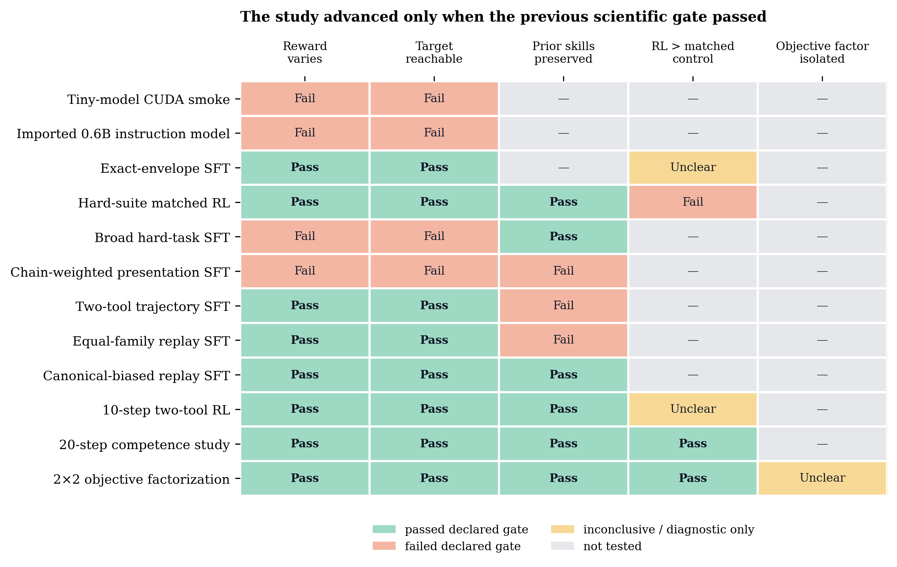
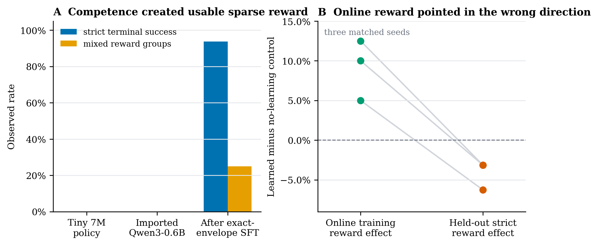
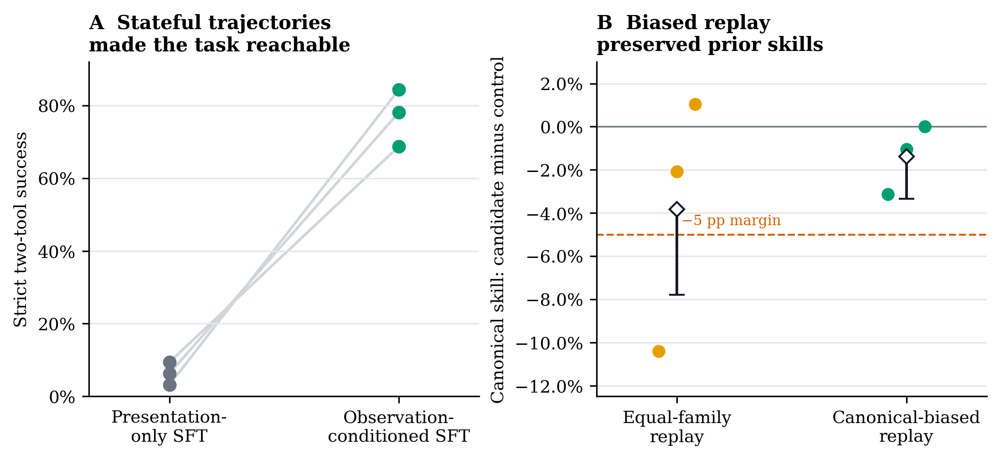
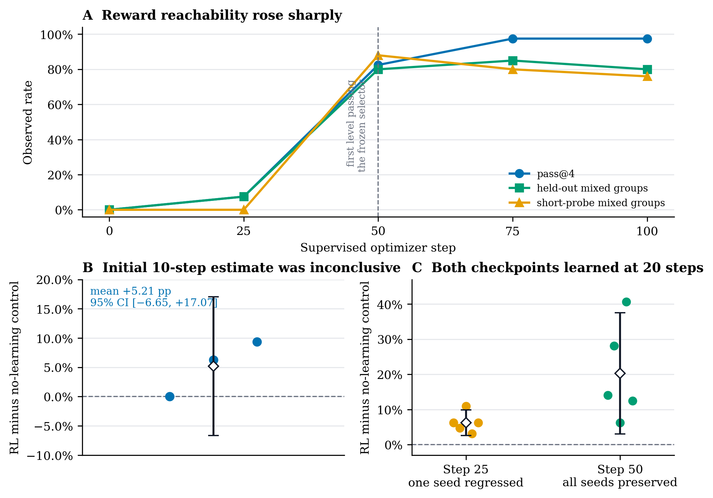
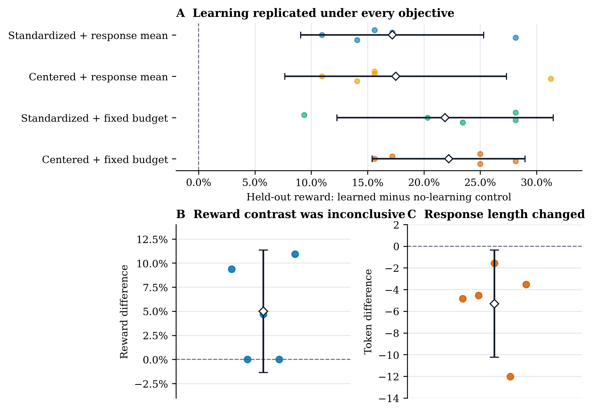

# When Does Verifier-Guided RL Help a Small Tool-Using Model?

## A controlled study of reachability, retention, matched efficacy, and objective geometry

## Abstract

Sparse-reward post-training is an information problem before it is an
optimization problem. A policy update can amplify a successful trajectory only
if the policy visits that trajectory, the environment exposes the state on
which its actions depend, and the verifier distinguishes it from the failures
sampled alongside it. Supervised learning, distillation, and reinforcement
learning act on different parts of this chain: supervision changes what the
policy can reach, on-policy learning changes how probability is allocated over
what it reaches, and replay constrains what must not be forgotten.

This study makes that decomposition concrete in a 0.6B instruction-trained
model solving an exact, multi-turn calculator task. The progression is the
result. The imported policy had useful language and tool priors but produced no
strict successes. Output-format SFT created sparse reward variation, yet online
reward then moved opposite to held-out reward. Static curricula showed the
desired second tool call without teaching the state in which it must be chosen.
Observation-conditioned trajectory SFT supplied that missing state and raised
two-tool success by 70.83 percentage points across three matched seeds. That
same intervention damaged prior behavior until canonical-biased replay turned
the handoff into a constrained curriculum.

Once reachability and retention were both in place, verifier-guided RL produced
repeatable held-out gains. At the first checkpoint passing a frozen signal
selector, a 20-step learned continuation improved over matched no-learning
controls in all five seeds, by 20.31 points on average (95% CI
[3.07, 37.56]). Its weaker predecessor also learned under the longer rollout
budget, revealing that the apparent competence boundary was really a boundary
of *finite-budget observability*. A fresh 2×2 objective study reproduced the
learning effect in every arm and seed. The objective factors changed completion
length more clearly than reward, separating policy efficacy from response
geometry.

The resulting picture is a staged learning system:

> **Acquire support → expose on-policy variation → preserve existing behavior
> → establish a paired learning effect → isolate the mechanism.**

## Research thesis

The core object is the joint distribution induced by the policy and the
environment, not the training algorithm in isolation. For prompt \(x\), the
policy samples an action, the environment returns an observation, and the next
action is conditioned on that observation. A terminal verifier sees only the
completed trajectory. Three distinct failures can all appear as “RL does not
work”:

- the successful trajectory is outside the policy’s sampled support;
- the trajectory is reachable, but finite rollouts do not expose useful reward
  contrast often enough;
- the update improves the target while moving probability away from behavior
  that the model already performed well.

These failures call for different interventions. More RL steps cannot repair a
missing action under an unseen state. More demonstrations need not improve a
policy if they show the right tokens under the wrong conditioning context. A
successful target metric is incomplete when the curriculum silently trades
away existing competence.

The experiment was therefore organized as a sequence of discriminating tests:

| Layer of the problem | Question | Observable | Intervention when it fails |
|---|---|---|---|
| Execution | Does the implementation realize the intended estimator and environment? | deterministic tasks, verifier checks, nonzero gradients, checkpoint parity | repair the system |
| Support | Can the policy produce the complete target trajectory? | strict reward and pass@4 | change supervision or model |
| On-policy information | Do sampled groups disagree in reward? | mixed-group rate | change competence, sampling, or rollout budget |
| Retention | Is new behavior compatible with prior skills? | frozen precision and capability suite | rebalance replay |
| Efficacy | Does learning change held-out behavior? | learned minus matched no-learning control | change update or reject continuation |
| Mechanism | Which objective factor causes the change? | controlled factorial contrasts | run a factorized experiment |

Each row asks a different causal question. Advancing only after the previous row
was understood kept infrastructure success, task reachability, and policy
improvement from becoming interchangeable stories.



*Figure 1. Complete decision record. “Pass” means the declared gate for that
stage was met; “Fail” means it was not; “Unclear” marks a diagnostic or an
interval that left the downstream question unresolved. A dash means that the
downstream question was intentionally not tested. Infrastructure smokes appear
because they establish that the machinery executed, but they are not treated as
learning evidence.*

## Experimental system

### Policy and adaptation

- **Model:** Qwen3-0.6B, an instruction-trained decoder-only language model.
- **Native conversion:** 596,623,360 parameters were imported into Minilab.
  Native-versus-Hugging-Face logit checks had maximum absolute error
  `4.48e-05` and mean absolute error `4.02e-06` on the parity probe.
- **Adaptation:** query/value LoRA, rank 4 and alpha 8, unless a result explicitly
  concerns the unadapted model.
- **Supervised handoff recipe:** the final canonical-biased curriculum used 100
  optimizer steps, batch size 1 with four-step gradient accumulation, and
  learning rate `2e-5`.
- **RL sampling:** four completions per prompt. The two-tool experiments used a
  three-stage rollout—first call, second call after the first observation, and
  final answer—with separate action credit, at most 64 generated tokens per
  stage, and learning rate `1e-5` for learned arms.
- **Hardware:** the accelerated experiments ran on one NVIDIA L4. Hardware is
  reported to locate the systems result and its resource regime.

An “SFT step” in the competence map means one optimizer step along the fixed
canonical-replay training trajectory. It is an operational index of this
specific curriculum, not a portable unit of model capability.

### The exact two-tool task

A prompt requests a composition of two additions. A successful trajectory has
the following causal structure:

```text
user:      Add 7 and 5, then add 3 to that result.
assistant: {"tool":"add","arguments":{"a":7,"b":5}}
tool:      12
assistant: {"tool":"add","arguments":{"a":12,"b":3}}
tool:      15
assistant: <answer>15</answer>
```

The verifier returns terminal reward 1 only when all of the following are
correct:

- both assistant actions are valid JSON in the required envelope;
- both actions select the requested tool;
- the first action uses the two requested source operands;
- the second action uses the observed intermediate result and the final operand;
- both environment observations match the executed calls;
- the final answer uses the exact answer envelope, has the correct value, and
  is grounded in the second observation.

Any violation yields terminal reward 0. Intermediate metrics—JSON validity,
tool choice, argument match, observation match, answer format, and grounding—
were retained for diagnosis, but none was substituted for the strict endpoint.

### Why mixed groups are a prerequisite for the tested estimators

For a prompt with group rewards \(r_1,\ldots,r_K\), the centered advantage is

\[
A_i^{\mathrm{centered}} = r_i - \bar r,
\qquad
\bar r = \frac{1}{K}\sum_{j=1}^{K} r_j.
\]

The standardized form is

\[
A_i^{\mathrm{standardized}} =
\frac{r_i-\bar r}{s_r + \epsilon}.
\]

If every reward is zero—or every reward is one—then every centered advantage
is zero. A **mixed group** contains at least one success and at least one
failure. With the binary verifier used here, mixed-group rate is therefore a
direct measure of how often the batch contains a group-relative task signal.
It is not a sufficient condition for useful learning: finite sampling can miss
rare successes, and a nonzero estimator can still overfit or damage other
skills.

For fixed group size \(K=4\), the leave-one-out REINFORCE baseline does not
define an independent directional experiment:

\[
A_i^{\mathrm{LOO}}
= r_i - \frac{1}{K-1}\sum_{j\ne i}r_j
= \frac{K}{K-1}(r_i-\bar r)
= \frac{4}{3}A_i^{\mathrm{centered}}.
\]

Without compensating for this constant, a separate RLOO arm would primarily
change effective gradient scale. It was therefore analyzed algebraically
rather than presented as a distinct mechanism.

### Controls and estimands

The efficacy experiments paired each learned arm with a **no-learning
control**: the same source checkpoint, seed, prompts, generation settings,
number of steps, save/reload path, and evaluation protocol, but learning rate
zero. The primary estimand was the seed-level difference in held-out strict
reward:

\[
\Delta_s = \hat R_{s,\mathrm{learned}}-
           \hat R_{s,\mathrm{control}}.
\]

This control absorbs sampling, checkpoint reload, evaluation, and continuation
effects that a simple pre/post comparison cannot distinguish from learning.
The reported 95% intervals are Student-\(t\) intervals over paired seed-level
effects. With three or five seeds they are descriptive uncertainty summaries,
not population-scale guarantees.

The three-seed studies used training seeds 17, 42, and 73. The competence and
objective studies added seeds 101 and 137. Evaluation seeds and prompt blocks
were distinct from training seeds and were matched within every treatment–
control pair.

### Metrics and retention checks

- **Strict reward / pass@1:** mean terminal reward across sampled trajectories.
- **pass@4:** fraction of prompts with at least one successful trajectory among
  four samples.
- **Mixed-group rate:** fraction of four-sample prompt groups containing both
  reward values.
- **Online reward:** reward observed on the training rollout stream.
- **Held-out reward:** reward on prompts not used for the update being assessed.
- **Retention:** canonical code repair, single-tool agent behavior, and exact
  answer-format checks. The replay comparison used a larger frozen precision
  audit and a -5 percentage-point non-inferiority margin.
- **Diagnostics:** completion length, stage success, advantage statistics,
  clipping, entropy, KL, gradient norm, and rollout/training memory behavior.

Prompt blocks were retired after use. Later studies used fresh training and
evaluation streams; their extra seeds do not retroactively increase the sample
size of earlier studies.

## Experimental argument

### 1. Execution can be correct while learning signal is absent

The first question was whether a zero-reward run meant a broken system or a
policy distribution with no useful task signal. That distinction determines
whether to debug the implementation or change the policy.

The initial engineering work established deterministic task generation,
hidden and metamorphic verifier checks, native checkpoint conversion, LoRA
wiring, multi-turn action attribution, checkpoint metadata, and end-to-end L4
execution. A 7.37M-parameter smoke policy completed two separate 10-step CUDA
runs, but every completion degenerated to repeated `s` tokens. Rewards, reward
variance, and advantages were all zero.

The run therefore separated execution from learning: the estimator was being
computed, but its task component was exactly zero.

Imported SmolLM2-135M and Qwen3-0.6B policies were qualitatively stronger: they
generated coherent code and tool-like text. Nevertheless, strict terminal
reward remained zero for both, and the smaller checkpoint was not promoted.
Qwen3-0.6B became the study policy because it exposed partial tool competence
without yet satisfying the exact task.
On the single-tool diagnostic, partial tool-stage scores ranged from 0.25 to
0.75, but malformed final envelopes kept answer reward and group-relative
advantages at zero. The longer RL launch was stopped.

### 2. Format supervision moved success onto sampled support

The partial tool scores suggested that the model’s semantic prior was better
than its terminal reward implied. The immediate bottleneck was protocol
closure: a nearly correct action still received zero when the exact envelope or
final answer was malformed. A small supervised intervention could test whether
format competence was enough to expose reward variation.

A 50-step structured-output SFT run taught exact raw-code, tool-call, and answer
envelopes. After correcting EOS handling in the evaluator, the pre-RL probe
measured:

| Diagnostic | Result |
|---|---:|
| Strict single-tool terminal success | 15/16 = 93.75% |
| Exact answer format | 16/16 = 100% |
| Mixed four-sample groups | 25% |
| Code syntax | 4/4 |
| Code semantics after the visible-test correction | 3/4 |

This checkpoint crossed the first scientific gate: the verifier could now
observe both successes and failures. A one-seed, 10-step pre/post continuation
remained 93.75% to 93.75%. That comparison answered an execution question; a
matched continuation was still needed to estimate learning.



*Figure 2. (A) Signal diagnostics across successive policy families.
Exact-envelope SFT made strict success and mixed groups observable. (B) In the subsequent three-seed
matched hard-suite experiment, the learned branch looked better than its
control on the online training stream but worse on held-out strict reward. Each
line joins the two measurements for one training seed.*

### 3. The matched control reversed the online-reward interpretation

Once reward varied, the next question was whether optimization improved the
policy or merely improved its interaction with a small adaptive training
stream. The relevant comparison was learned versus zero-learning continuation
on new prompts, not the slope of training reward.

The next experiment used a harder held-out suite and compared SFT-only, learned
RL, and learning-rate-zero continuations across three seeds.

| Seed | SFT-only | Learned RL | No-learning control | Learned - control |
|---:|---:|---:|---:|---:|
| 17 | 59.375% | 56.250% | 59.375% | -3.125 pp |
| 42 | 65.625% | 62.500% | 65.625% | -3.125 pp |
| 73 | 68.750% | 62.500% | 68.750% | -6.250 pp |
| **Mean effect** |  |  |  | **-4.167 pp** |

The paired 95% interval was [-8.65, +0.32] points, and no seed had a positive
held-out effect. On the online training stream, however, learned-minus-control
effects were +12.5, +10.0, and +5.0 points.

This was the first substantive result: **online verifier reward was not a valid
proxy for held-out efficacy in this regime.** The experiment redirected the
study from longer optimization to source-policy design. The live explanation
was that the policy had enough competence to overfit a narrow rollout stream,
but not enough robust coverage of the harder task to improve out of sample.

### 4. Static curricula trained the right tokens under the wrong state

The next three interventions tested whether the hard task merely needed more or
better-weighted examples.

| Intervention | Key result across three seeds | Decision |
|---|---|---|
| Broad hard-task curriculum over 12 training code families | Held-out challenge code rose from 12.5% to 25.0% in every seed, below the declared 25-point gain; chained reward stayed 0% | Do not run RL |
| Chain-weighted presentation SFT versus matched basic SFT | Exact intermediate arguments stayed 0% in every seed; some standard metrics regressed | Reject the curriculum |
| Seen/adjacent/fixed diagnostic | Exact arguments stayed 0% on sampled training rows, neighboring rows, and a fixed set in every seed | Replace the supervision unit |

The seen-row failure is especially informative. It rules out a purely
held-out-generalization explanation. The training examples exposed desired
tool-call text, but did not reproduce the causal state in which the second
action must be selected **after observing the first tool result**. The missing
object was not another static answer; it was an observation-conditioned policy
trajectory.

### 5. Observation-conditioned supervision supplied the missing state

The diagnostic implied a specific intervention: reproduce the environment
transition inside the supervised example, so the second tool call is learned
under the observation that determines its arguments. This tests state coverage,
not simply dataset size.

The supervision unit was changed to actual two-tool trajectories containing
both environment observations. Against matched presentation-only SFT controls,
strict two-tool reward changed as follows:

| Seed | Presentation-only SFT | Observation-conditioned SFT | Gain |
|---:|---:|---:|---:|
| 17 | 9.375% | 68.750% | +59.375 pp |
| 42 | 6.250% | 78.125% | +71.875 pp |
| 73 | 3.125% | 84.375% | +81.250 pp |
| **Mean** | **6.250%** | **77.083%** | **+70.833 pp** |

First- and second-call component metrics rose with terminal reward, supporting
the intended mechanism: the model learned to condition the second call on the
environment observation. But standard code, single-tool, and answer-format
behavior regressed in every seed family. Reachability had been established;
retention had not.

### 6. Replay was a constraint, not merely extra data

An equal-family replay mixture kept two-tool reward high—78.125%, 71.875%, and
78.125% across the three seeds—and repaired most small standard checks. It
still failed the larger frozen precision audit:

- seed-level canonical reward effects were -10.417, -2.083, and +1.042 points;
- the mean effect was -3.819 points;
- the one-sided 95% lower bound was -7.787 points, below the declared -5-point
  non-inferiority margin.

The audit evaluated 96 outcomes per checkpoint and seed, 576 validated records
in total across the paired candidates and controls. The checkpoint family was
rejected. This is a case where a small preservation suite would have promoted
the wrong policy.

The next curriculum deliberately biased replay toward the canonical skills at
risk. Its 1,200 supervised records contained 400 raw examples, 500 canonical
examples (250 tool and 250 answer), and 300 two-tool stages (100 for each
trajectory stage). After 100 optimizer steps:

| Seed | Matched basic SFT | Canonical-biased replay | Gain |
|---:|---:|---:|---:|
| 17 | 9.375% | 65.625% | +56.250 pp |
| 42 | 6.250% | 81.250% | +75.000 pp |
| 73 | 3.125% | 78.125% | +75.000 pp |
| **Mean** | **6.250%** | **75.000%** | **+68.750 pp** |

On the independent 576-record precision audit:

- the independent precision-audit effects were -3.125, -1.042, and 0 points;
- the mean precision effect was -1.389 points;
- the one-sided 95% lower bound was -3.353 points, above the -5-point margin;
- every candidate reward and answer-format floor passed.

This was the first policy family eligible for RL. The deeper lesson is that
replay implemented a behavioral constraint: weighting had to reflect the
asymmetric cost of forgetting, not the number of named task families.



*Figure 3. (A) Paired seed-level strict reward before and after replacing
presentation-only examples with observation-conditioned trajectories. (B)
Canonical-skill effects in the independent precision audit. Points are seed
effects; diamonds are means; the downward whisker is the one-sided 95% lower
bound used for non-inferiority. Only canonical-biased replay remained above the
-5-point margin.*

### 7. The first paired RL estimate determined the next measurement

The accepted replay checkpoints entered a three-seed, 10-step matched study.
Each branch trained on 16 cases with four generations and was evaluated on
eight untouched cases with four generations. Learned-minus-control strict
reward effects were 0, +6.25, and +9.375 points. The mean was +5.208 points,
with paired 95% CI [-6.65, +17.07]. Two of three seeds were positive and all
standard retention checks passed.

The interval left three live models of the run: a useful effect obscured by
seed variance, an update too small to matter, or a locally harmful update. A
longer continuation of the same arms would have entangled these explanations
with adaptation to the same stream. The next experiment instead increased
resolution with a fresh competence map, five seeds, new prompts, and an explicit
finite-budget selector.

### 8. The competence map measured information available under a fixed budget

Five independent canonical-replay SFT trajectories were evaluated at optimizer
steps 0, 25, 50, 75, and 100. Before observing outcomes, a checkpoint was
declared signal-bearing only if it met all four criteria:

- mean held-out mixed-group rate at least 20%;
- mean short no-learning-probe mixed-group rate at least 20%;
- at least four of five seeds observed a mixed group in the short probe; and
- mean held-out pass@4 at least 25%.

The held-out selector used eight prompts with four samples per seed. The short
probe used five no-learning steps over 16 prompts. The map was:

| SFT step | Strict reward | pass@4 | Held-out mixed groups | Short-probe mixed groups | Selector |
|---:|---:|---:|---:|---:|---|
| 0 | 0.000% | 0.0% | 0.0% | 0.0% | Fail |
| 25 | 1.875% | 7.5% | 7.5% | 0.0% | Fail |
| 50 | 36.875% | 82.5% | 80.0% | 88.0% | First pass |
| 75 | 68.125% | 97.5% | 85.0% | 80.0% | Pass |
| 100 | 68.750% | 97.5% | 80.0% | 76.0% | Pass |

Step 50 and its step-25 predecessor were then compared on a fresh 20-step
training and evaluation block: 16 prompts × four samples per arm and seed.

| Source checkpoint | Seed effects, learned - control | Mean effect | Paired 95% CI | Retention |
|---|---|---:|---:|---|
| SFT step 25 | +6.25, +4.6875, +10.9375, +3.125, +6.25 pp | +6.250 pp | [+2.620, +9.880] | One seed regressed single-tool standards |
| SFT step 50 | +14.0625, +28.125, +6.25, +40.625, +12.5 pp | +20.313 pp | [+3.069, +37.556] | All five seeds preserved |

Both checkpoint levels learned in all five seeds. The difference-in-differences
was +14.063 points, 95% CI [-6.424, +34.549]. Step 25 demonstrates why a short
mixed-group probe is a noisy selector: it observed no mixed groups, yet a longer
rollout block eventually encountered enough successes to learn.

The map therefore measures how much evidence a policy exposes under a fixed
sampling budget. **Step 50 was the first checkpoint at which learning was both
reliably visible and behaviorally retained under that budget.** The more useful
research variable is information per rollout, not an intrinsic SFT-step
threshold.



*Figure 4. (A) The five-seed competence map; the vertical line marks the first
checkpoint passing the frozen selector. (B) The earlier three-seed, 10-step
estimate remained inconclusive. (C) On a fresh 20-step block, both step 25 and
step 50 improved over matched controls, but only step 50 preserved all monitored
standard behavior. Points are seed effects; diamonds and bars are means and
two-sided 95% Student-t intervals.*

### 9. Objective factorization separated efficacy from response geometry

The five accepted step-50 sources entered a fresh 2×2 experiment. It crossed:

1. standardized versus merely centered group advantages; and
2. normalization by realized response length versus a fixed generation budget.

Each learned arm used the same 20-step budget and was compared with the same
matched no-learning control. All learned arms improved held-out reward in all
five seeds and preserved the standard suite:

| Advantage | Token-loss normalization | Mean reward effect | Paired 95% CI | Positive seeds |
|---|---|---:|---:|---:|
| Standardized | Response mean | +17.188 pp | [+9.071, +25.304] | 5/5 |
| Centered | Response mean | +17.500 pp | [+7.665, +27.335] | 5/5 |
| Standardized | Fixed generation budget | +21.875 pp | [+12.272, +31.478] | 5/5 |
| Centered | Fixed generation budget | +22.188 pp | [+15.411, +28.964] | 5/5 |

The primary contrast compared the centered/fixed-budget corner with the
standardized/response-mean corner. Its seed-level reward effects were +9.375,
0, +4.6875, 0, and +10.9375 points: mean +5.00 points, 95% CI
[-1.346, +11.346]. No factorial reward contrast excluded zero. The objective
study therefore replicated learning but did not rank estimators.

The behavioral contrast was clearer. The same primary comparison shortened
completions by 4.83, 4.55, 1.56, 12.03, and 3.53 tokens: mean -5.30 tokens,
95% CI [-10.235, -0.365]. pass@4 was identical between those two corners for
every seed. The fixed-budget/centered objective changed how the policy expressed
successful behavior without demonstrating more reachable solutions.



*Figure 5. (A) Every learned objective beat its matched no-learning control on
the fresh five-seed block. (B–C) The predeclared corner contrast—centered plus
fixed budget minus standardized plus response mean—did not isolate a reward
gain, but did isolate shorter completions. Points are paired seed effects;
diamonds and bars are means and two-sided 95% Student-t intervals.*

## Mechanistic synthesis

### Supervision changes occupancy; RL changes probability within it

For an on-policy objective, the task-directed update has the schematic form

\[
g(\theta) =
\mathbb{E}_{x,\tau\sim\pi_\theta}
\left[A(x,\tau)\nabla_\theta\log\pi_\theta(\tau\mid x)\right].
\]

The verifier determines \(A\), but the current policy determines which
trajectories ever enter the expectation. When the 0.6B policy sampled no exact
successes, centered task advantages vanished. Observation-conditioned SFT
changed \(\pi_\theta(\tau\mid x)\): it moved successful trajectories into the
sampled distribution. RL could then change their relative probability.

This gives SFT and RL complementary roles. SFT is a support-acquisition
operator; RL is an on-policy allocation operator. Their order is governed by
the source policy, not by a universal recipe. A large pretrained model can
begin in the signal-bearing regime—the setting exploited by RL-zero systems.
The small exact-protocol model began outside it.

### The decisive curriculum variable was causal state coverage

A two-tool trajectory factorizes as

\[
\pi(a_1\mid x)\;P(o_1\mid x,a_1)\;
\pi(a_2\mid x,a_1,o_1)\;P(o_2\mid \cdots)\;
\pi(a_3\mid x,a_1,o_1,a_2,o_2).
\]

Presentation-only data showed tokens resembling \(a_2\), but not under the
conditioning state \((x,a_1,o_1)\) that determines them. The model failed even
on sampled training rows, so adding nearby examples or increasing their weight
could not address the mismatch. Genuine trajectories changed the supervised
conditional itself. The 70.83-point reachability gain is best understood as a
state-coverage result, not a generic data-volume result.

This distinction scales beyond calculators. In any agentic task, an early
action changes the observation distribution for every later action. Training
only on final text or flattened demonstrations can leave the policy accurate
under teacher states and unreliable under environment states.

### Competence controls information per rollout

Let \(p_x\) be the policy’s success probability on prompt \(x\). With group size
\(K\), a binary-reward group is informative for a centered estimator with
probability

\[
q_K(p_x) = 1-p_x^K-(1-p_x)^K.
\]

For a rollout budget of \(B\) prompt groups, the expected number of informative
groups is approximately \(B\,\mathbb{E}_x[q_K(p_x)]\). This exposes three
levers that are often conflated:

- SFT or distillation changes \(p_x\);
- group size changes \(q_K\) at fixed \(p_x\);
- rollout budget changes how often rare informative groups are encountered.

The step-25 checkpoint makes the interaction visible. Its short probe found no
mixed group, while the 20-step experiment found enough signal for positive
effects in all five seeds. Step 50 moved substantially more prompts into the
intermediate-competence band and produced a larger, fully retained effect. The
“boundary” is therefore an operating point in competence × group size × budget
space.

### Replay is a behavioral constraint on the handoff

The curriculum problem can be written as a constrained objective:

\[
\max_\theta R_{\text{two-tool}}(\theta)
\quad\text{subject to}\quad
R_j(\theta) \ge R_j(\theta_0)-\delta_j
\quad\text{for each retained skill }j.
\]

Trajectory-only SFT optimized the target and violated the constraints.
Equal-family replay assigned symmetric data mass even though the empirical
forgetting costs were asymmetric. Canonical-biased replay increased pressure
on the active constraints and preserved the target gain. Replay weight is thus
a control variable tied to measured behavior, not a bookkeeping choice about
dataset balance.

### Efficacy is a counterfactual; training reward is a trajectory statistic

Online reward answers “what reward did this adaptive policy observe while it
was collecting its update?” The paired held-out estimand answers “what changed
because the optimizer was allowed to learn?” The learning-rate-zero branch
constructs the local counterfactual while preserving sampling, serialization,
and evaluation effects.

The hard-suite experiment made the distinction empirical: every online effect
was positive and every held-out effect was negative. Later five-seed studies
then reproduced positive learned-minus-control effects on fresh blocks. The
control is what converts an optimization trace into a statement about policy
change.

### Objective choice shapes the geometry of the update

Reward standardization and response-length normalization change which samples
and tokens receive weight. Dividing by within-group dispersion emphasizes
low-variance groups; dividing by each realized response length changes the
per-token scale as a function of the policy’s own output length. Removing these
normalizers changes the geometry of the update even when the reward function is
unchanged.

All four factorial arms learned, so the efficacy result was robust to the
tested objective choices. The primary objective contrast changed response
length while pass@4 remained identical. In this experiment the clearest
objective-level phenomenon was therefore *how success was expressed*, while
the available reward resolution left the objective ordering open.

### SFT, distillation, and RL form a spectrum of state coverage and feedback

The observation-conditioned SFT result suggests a precise next comparison.
Off-policy trajectory SFT supplies correct actions in teacher-selected states.
On-policy distillation supplies dense teacher guidance in states generated by
the student. Sparse RL supplies terminal feedback on the same student occupancy
without requiring the student to imitate the teacher’s token distribution.

For multi-turn agents, these mechanisms have complementary strengths:

- **Off-policy trajectory SFT** efficiently installs missing behavior when the
  demonstration covers the environment state that makes the action meaningful.
- **On-policy distillation** reduces student-state distribution mismatch and can
  provide a learning direction before terminal successes are frequent.
- **Verifier-guided RL** preserves freedom in the reasoning path and directly
  optimizes correctness once successful and failed trajectories coexist.
- **Hybrid training** can use dense teacher guidance for early state coverage
  and terminal reward to correct teacher imitation toward task success.

The two-tool environment is well suited to this comparison because state
coverage, teacher correction, terminal success, and retention are all directly
observable.

## How this fits the existing research picture

The apparent tension between “RL needs SFT” and “RL-zero works” dissolves when
framed through policy occupancy. [DeepSeek-R1](https://arxiv.org/abs/2501.12948)
shows that a sufficiently capable pretrained policy can expose useful reasoning
trajectories to large-scale RL without preliminary SFT. Its full R1 pipeline
also combines cold-start data and multi-stage training. The present competence
map supplies a small-scale view of the same dependency: the role of supervision
is to move the policy into a region where a finite rollout budget contains
information, not to satisfy a ceremonial stage in a recipe.

[Understanding R1-Zero-Like Training](https://arxiv.org/abs/2503.20783) likewise
places substantial explanatory weight on the base policy and identifies a
response-length bias induced by GRPO normalization. That motivates treating
reward-dispersion and token-count denominators as explicit experimental factors.
The factorial result here adds a useful separation: estimator choice can alter
response geometry even when every objective produces a positive policy effect
and their reward ordering remains unresolved.

Capability-boundary work asks a deeper question than held-out pass@1. [Does RL
Really Incentivize Reasoning Capacity Beyond the Base Model?](https://arxiv.org/abs/2504.13837)
uses large-\(k\) evaluation to ask whether RL creates new successful modes or
compresses probability onto modes already present in the source policy. The
Minilab experiments currently establish the latter observable—higher pass@1
under short sampling. A large-\(k\) study is the natural bridge from policy
improvement to support expansion.

The trajectory-SFT result connects directly to distillation research.
[Generalized Knowledge Distillation](https://arxiv.org/abs/2306.13649) trains on
student-generated sequences to reduce the train–inference distribution gap.
[Step-wise On-policy Distillation for Small Language Model Agents](https://arxiv.org/abs/2605.07725)
shows why this becomes step-dependent in tool use: an early wrong action changes
later states and can make teacher guidance increasingly misaligned.
[Self-Supervised On-Policy Distillation](https://arxiv.org/abs/2605.17497) goes
one step further by converting correct–wrong contrast inside a mixed group into
dense process supervision. Together, these works suggest using the mixed group
not only as a scalar RL signal, but as a source of state-local corrective
information.

Finally, [REINFORCE leave-one-out](https://arxiv.org/abs/2402.14740) and the
[group-standard-deviation identity](https://arxiv.org/abs/2607.00152) clarify
the estimator algebra. At fixed group size four, the leave-one-out advantage is
a constant multiple of the centered advantage; an uncompensated comparison
would primarily change effective step size. Standard deviation normalization,
by contrast, changes the relative weight of prompts according to sampled reward
disagreement. These identities determined which arms were scientifically
distinct enough to run.

## Systems details that changed the experiment

Two implementation corrections changed the measurement itself:

1. The first multi-stage RL implementation retained twelve computation graphs
   simultaneously and exceeded the L4’s 21.62 GB memory. Streaming backward
   released each stage graph after contributing to the same accumulated
   optimizer update. The corrected smoke used 4.49 GB and final runs used
   4.74–4.78 GB. The scientific invariant—one update from the same staged
   objective—was preserved.
2. Evaluator semantics were treated as part of the measurement. EOS handling
   was corrected before reporting structured success; code semantics were
   revised from the syntax result after applying the intended visible tests;
   no-learning controls were added after pre/post comparisons proved
   ambiguous.

The general principle is that systems work is part of the estimator. Memory
layout determines which objective can be executed; caching and resume logic
determine whether matched branches remain matched; evaluator semantics
determine the outcome being optimized. An optimization is scientifically
useful when it preserves those invariants while changing the cost of the
measurement.

## Scope and unresolved variables

### Transfer axes

The controlled system uses one 0.6B instruction-trained model, Q/V LoRA, one
calculator grammar, and binary terminal reward. The next transfer axes are
model scale, full-parameter adaptation, longer tool horizons, heterogeneous
tools, and graded verifier feedback. The current environment isolates state
coverage cleanly; broader environments will reveal which part of the mechanism
survives task diversity.

### Statistical resolution

Three- and five-seed paired intervals make seed variation visible, while the
shared prompt generator keeps task-family variation narrow. The initial
10-step and later 20-step experiments also change checkpoint, prompt block,
seed count, and budget together. A common-grid follow-up is needed to estimate
competence × rollout-budget interaction directly. The objective factorial
similarly needs more resolution to rank small reward effects that are currently
subordinate to the replicated learned-versus-control effect.

### Retention and capability depth

The retention suite measures canonical code, single-tool behavior, and exact
formatting. It provides a concrete constraint for this task family, while broad
language, safety, and cross-domain retention remain separate axes. On the target
side, pass@1 and pass@4 measure probability concentration under short sampling.
Large-\(k\) coverage and trajectory novelty would distinguish search compression
from expansion of the source policy’s successful support.

### Feedback mechanism

The study directly compares supervised state coverage and sparse verifier
feedback. Teacher-based on-policy distillation is the missing third mechanism.
Adding it under matched token, rollout, and teacher-compute budgets would show
whether dense student-state feedback reaches the signal-bearing regime more
efficiently, and whether terminal RL still adds value after that transition.

## Next experiments, ordered by information value

1. **Resolve the competence-by-budget interaction.** Run SFT steps 0, 25, 50,
   75, and 100 under the same 20-step RL protocol, fresh prompts, and enough
   seeds to estimate the interaction. This distinguishes a smooth
   sample-efficiency curve from a genuine regime change.
2. **Compare supervision occupancy directly.** Match token and generation
   budgets for presentation-only SFT, observation-conditioned off-policy SFT,
   step-wise on-policy distillation, sparse RL, and hybrid distillation plus RL.
   Measure state coverage, mixed-group rate, terminal reward, and retention.
3. **Test support expansion.** Evaluate source and trained policies at much
   larger \(k\), inspect novel successful trajectories, and separate search
   compression from capability expansion.
4. **Intervene on group informativeness.** Cross group size with prompt
   selection or dynamic resampling, measuring zero-variance groups and learning
   per generated token rather than only final reward.
5. **Power the objective factorial.** Keep source policies, prompts, rollout
   budget, and effective gradient scale fixed while estimating the two main
   effects and their interaction. Treat length as a mediated outcome, not an
   automatic quality improvement.
6. **Increase environment depth.** Add longer tool chains and perturbed tool
   observations. Hidden and metamorphic checks should verify that the policy
   conditions on returned state rather than memorizing surface templates.

The stopping rule should remain the same: launch a larger or more expensive run
only when it distinguishes live hypotheses that the current evidence cannot.

The central inference is that “can this model learn from RL?” is not a property
of the optimizer or checkpoint alone. It is a property of the policy-induced
state distribution, the verifier, the group and rollout budget, and the
behavioral constraints imposed on the update. Treating those as separate,
measurable objects turned a sequence of zero rewards, regressions, and unstable
point estimates into a coherent training recipe and a sharper next research
program.
